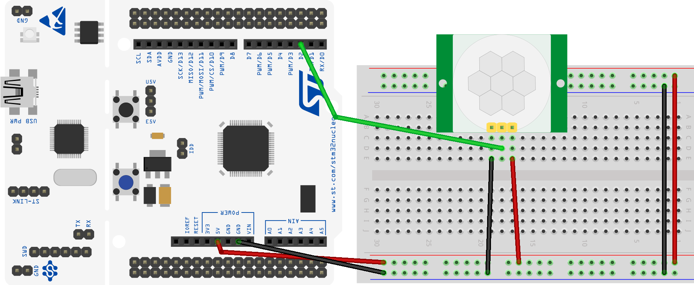
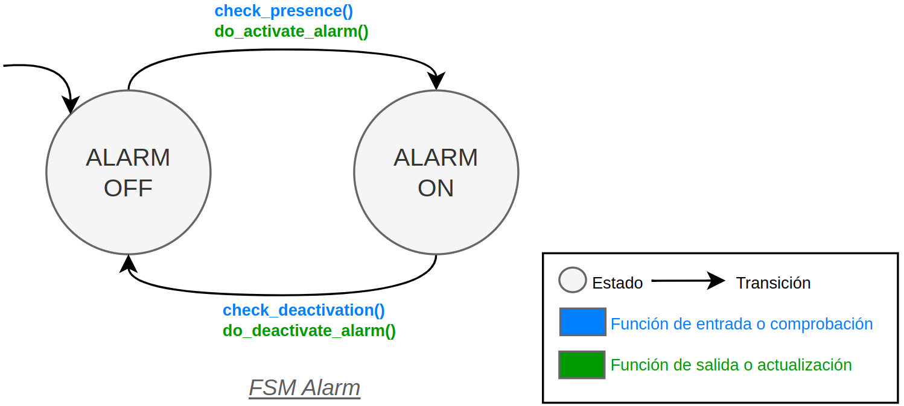

# Alarm system

This project implements an alarm system with a PIR, a button and a LED. The HW configuration is shown in the following picture:

The system uses an FSM to manage the different states of the system and hardware. This picture shows the FSM of the system:

You can generate as many alarm system as you want by creating a new FSM and assigning the corresponding peripherals to the system. The system which is implemented in the `main.c` file. The system uses the following peripherals:

## PIR sensor

The PIR sensor is connected to the pin `PA10`. The sensor is configured as an input with no push-pull resistor. The sensor generates an interrupt when it detects movement. The interrupt is configured with the following settings:

| Parameter     | Value                    |
| ------------- | ------------------------ |
| Variable name | pir_sensor_home_alarm    |
| Pin           | PA10 (D2 on Nucleo)      |
| Mode          | Input                    |
| Pull up/ down | No push no pull          |
| Edge          | Both: Rising and Falling |
| EXTI          | EXTI10                   |
| ISR           | EXTI15_10_IRQHandler()   |
| Priority      | 1                        |
| Subpriority   | 0                        |

## Button

The button is connected to the pin `PC13`. The button is configured as an input with no push-pull resistor. The button generates an interrupt when it is both pressed and released. The interrupt is configured with the following settings:

| Parameter     | Value                    |
| ------------- | ------------------------ |
| Variable name | button_home_alarm        |
| Pin           | PC13 (B1 on Nucleo)      |
| Mode          | Input                    |
| Pull up/ down | No push no pull          |
| Edge          | Both: Rising and Falling |
| EXTI          | EXTI13                   |
| ISR           | EXTI15_10_IRQHandler()   |
| Priority      | 3                        |
| Subpriority   | 0                        |

## LED

The LED is connected to the pin `PA5`. The LED is configured as an output with no push-pull resistor. The LED is used to indicate the state of the system. The LED is configured with the following settings:

| Parameter     | Value               |
| ------------- | ------------------- |
| Variable name | led_home_alarm      |
| Pin           | PA5 (LD2 on Nucleo) |
| Mode          | Output              |
| Pull up/ down | No push no pull     |

The LED blinks with an interrupt interval of 500 ms and uses the TIM2 to generate the interrupt. The interrupt is configured with the following settings:

| Parameter   | Value             |
| ----------- | ----------------- |
| Interrupt   | TIM2_IRQHandler() |
| Interval    | 500 ms            |
| Priority    | 2                 |
| Subpriority | 0                 |

## References

- **[1]**: [Documentation available in the Moodle of the course](https://moodle.upm.es/titulaciones/oficiales/course/view.php?id=785#section-0)
- **[2]**: [Embedded Systems with ARM Cortex-M Microcontrollers in Assembly Language and C (Fourth Edition)](https://web.eece.maine.edu/~zhu/book/index.php) for explanations and examples of use of the ARM Cortex-M microcontrollers in C with CMSIS.
- **[3]**: [Programming with STM32: Getting Started with the Nucleo Board and C/C++](https://ingenio.upm.es/primo-explore/fulldisplay?docid=34UPM_ALMA51126621660004212&context=L&vid=34UPM_VU1&lang=es_ES&search_scope=TAB1_SCOPE1&adaptor=Local%20Search%20Engine&tab=tab1&query=any,contains,Programming%20with%20STM32:%20Getting%20Started%20with%20the%20Nucleo%20Board%20and%20C%2FC%2B%2B&offset=0) for examples of use of the STM32 microcontrollers with the HAL of ST.
- **[4]**: [The C Programming Language](https://ingenio.upm.es/primo-explore/fulldisplay?docid=34UPM_ALMA2151866130004212&context=L&vid=34UPM_VU1&lang=es_ES&search_scope=TAB1_SCOPE1&adaptor=Local%20Search%20Engine&isFrbr=true&tab=tab1&query=any,contains,C%20Programming%20Language)
- **[5]**: [Nucleo Boards Programming with th STM32CubeIDE](https://www.elektor.com/products/nucleo-boards-programming-with-the-stm32cubeide) for examples of use of the STM32 microcontrollers with the STM32CubeIDE.
