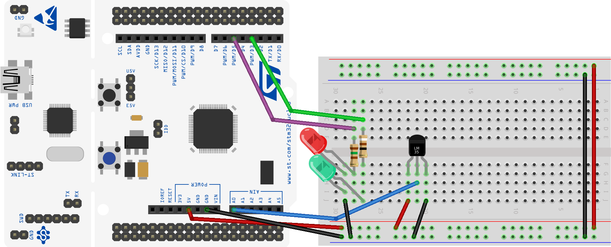
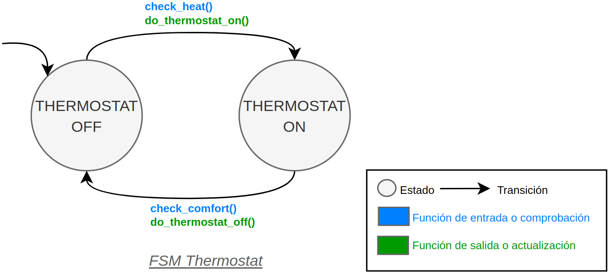
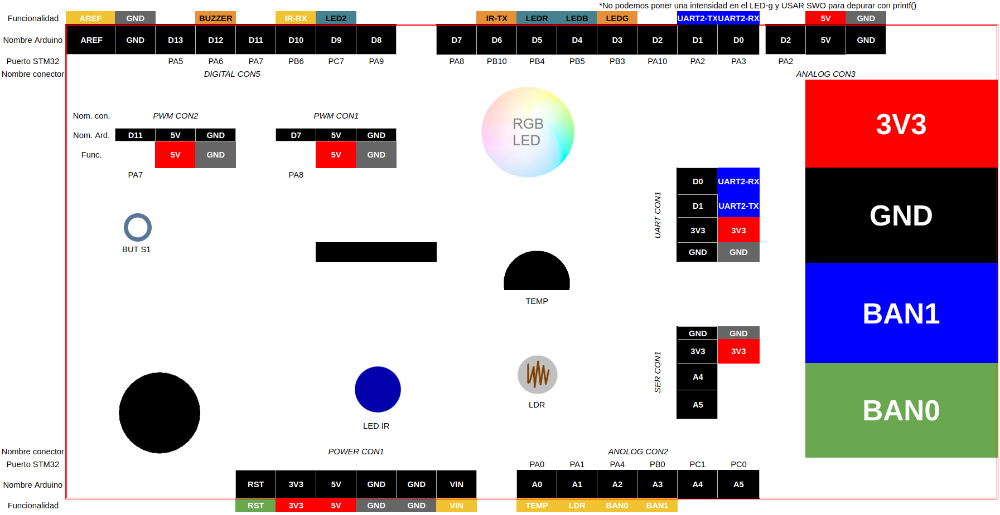

# Thermostat with FSM and ADC

This project implements a thermostat with an analog LM35 temperature sensor, and 2 LEDs. The HW configuration is shown in the following picture:

The system uses an FSM to manage the different states of the system and hardware. This picture shows the FSM of the system:

The thermostat makes a measurement every time its timer is triggered. The measurement is done by the ADC peripheral. The ADC is configured to sample the temperature sensor in single mode. The timer is configured in the `PORT` file of the system.

| Parameter     | Value                        |
| ------------- | ---------------------------- |
| Define label  | THERMOSTAT_MEASUREMENT_TIMER |
| Timer         | TIM2                         |
| Interrupt     | TIM2_IRQHandler()            |
| Time interval | 1 second                     |
| Priority      | 2                            |
| Subpriority   | 0                            |

You can generate as many thermostat as you want by creating a new FSM and assigning the corresponding peripherals to the system. The system which is implemented in the `main.c` file. The system uses the following peripherals:

## Temperature sensor

The temperature sensor used in the system is the LM35 (see [LM35 datasheet](https://www.ti.com/product/es-mx/LM35)). The sensor is located in the shield provided by the university. The sensor is connected to the pin `PA0`. The sensor is configured as an analog input with no push-pull resistor. The sensor is sampled in single mode with a sampling period given by the interruptions of a timer. All the configurations of the ADC are by default. The ADC is configured to interrupt when the conversion is completed. The ADC is configured with the following settings:

| Parameter     | Value                  |
| ------------- | ---------------------- |
| Variable name | temp_sensor_thermostat |
| Pin           | PA0 (A0 on Nucleo)     |
| ADC           | ADC1                   |
| Channel       | 0                      |
| Mode          | Analog                 |
| Pull up/ down | No push no pull        |
| ISR           | ADC_IRQHandler()       |
| Priority      | 1                      |
| Subpriority   | 0                      |

## LEDs

There are two LEDs in the system. The first LED is the `led_heater_active` (red) and the second LED is the `led_comfort_temperature` (blue). The `led_heater_active` is used to indicate that the temperature is below the threshold and the heater activates to warm the thermal system. The `led_comfort_temperature` is used to indicate that the temperature is above the threshold and the thermal system is off. The LEDs are within an RGB LED soldered in the shield provided by the university. The LEDs are connected to the pins `PB4` and `PB5`. The LEDs are configured as outputs with no push-pull resistor. The LEDs are turned on when the system starts. The LEDs are configured with the following settings:

| Parameter     | Value                   |
| ------------- | ----------------------- |
| Variable name | led_comfort_temperature |
| Pin           | PB5 (D4 on Nucleo)      |
| Mode          | Output                  |
| Pull up/ down | No push no pull         |

| Parameter     | Value              |
| ------------- | ------------------ |
| Variable name | led_heater_active  |
| Pin           | PB4 (D5 on Nucleo) |
| Mode          | Output             |
| Pull up/ down | No push no pull    |

There is also a third LED, the `led_on` (green), which is used to indicate that the system has started. This LED is not part of the system. The `led_on` is turned on when the system starts and is turned off after 500 ms. This LED can be disabled by commenting the line `#define USE_LED_ON` in the `main.c` file. The `led_on` is connected to the pin `PB3`.

| Parameter     | Value              |
| ------------- | ------------------ |
| Variable name | led_on             |
| Pin           | PB3 (D3 on Nucleo) |
| Mode          | Output             |
| Pull up/ down | No push no pull    |

> [!WARNING]
> **If you want to use the `printf()` function using the SWO, you must change the pin of the `led_on` to another pin. The SWO pin is the `PB3` pin. If you use the `led_on`, the SWO pin will not work.**
> If you want to use the SWO, you must comment the line `#define USE_LED_ON` in the `main.c` file. **In this case, **if you are using the shield provided by the university, the pin `PB3` will be active turning on the `led_on` constantly and you won't see pure red or blue LEDs but a mix of colors instead.**

Look at the following picture to see the shield provided by the university:

## References

- **[1]**: [Documentation available in the Moodle of the course](https://moodle.upm.es/titulaciones/oficiales/course/view.php?id=785#section-0)
- **[2]**: [Embedded Systems with ARM Cortex-M Microcontrollers in Assembly Language and C (Fourth Edition)](https://web.eece.maine.edu/~zhu/book/index.php) for explanations and examples of use of the ARM Cortex-M microcontrollers in C with CMSIS.
- **[3]**: [Programming with STM32: Getting Started with the Nucleo Board and C/C++](https://ingenio.upm.es/primo-explore/fulldisplay?docid=34UPM_ALMA51126621660004212&context=L&vid=34UPM_VU1&lang=es_ES&search_scope=TAB1_SCOPE1&adaptor=Local%20Search%20Engine&tab=tab1&query=any,contains,Programming%20with%20STM32:%20Getting%20Started%20with%20the%20Nucleo%20Board%20and%20C%2FC%2B%2B&offset=0) for examples of use of the STM32 microcontrollers with the HAL of ST.
- **[4]**: [The C Programming Language](https://ingenio.upm.es/primo-explore/fulldisplay?docid=34UPM_ALMA2151866130004212&context=L&vid=34UPM_VU1&lang=es_ES&search_scope=TAB1_SCOPE1&adaptor=Local%20Search%20Engine&isFrbr=true&tab=tab1&query=any,contains,C%20Programming%20Language)
- **[5]**: [Nucleo Boards Programming with th STM32CubeIDE](https://www.elektor.com/products/nucleo-boards-programming-with-the-stm32cubeide) for examples of use of the STM32 microcontrollers with the STM32CubeIDE.
